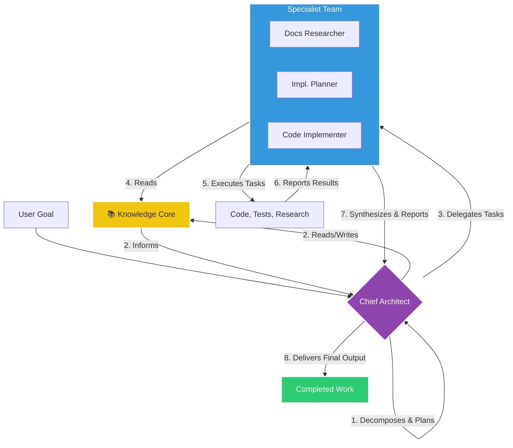

# 🕉️ Divine Orchestration System for Claude Code

[](https://opensource.org/licenses/MIT)
[](https://docs.anthropic.com/claude-code)
[](docs/01_philosophy.md)
[](DIVINE_ORCHESTRATION_INSTALLER.md)

> Transform your Claude Code CLI into a divine orchestration system with one powerful meta-prompt. An advanced multi-agent framework that brings enterprise-grade AI orchestration to every developer.

## 🚀 Quick Start - Native Installation (Recommended)

> **Important Update**: After researching Claude Code's official documentation, we discovered it already has powerful native orchestration capabilities! Use the Native installer for the best experience.

### ✨ Use the Native Installer (Recommended)

**Transform your Claude Code using its native features:**

1. Copy the entire content from [**NATIVE_ORCHESTRATION_INSTALLER.md**](NATIVE_ORCHESTRATION_INSTALLER.md) 
2. Paste it into Claude Code
3. Watch as your CLI configures native orchestration

```bash
# After installation, test with:
claude "Build a complete REST API with authentication"
claude "Optimize database performance"  
claude "Create comprehensive test suite"
```

This configures Claude Code's **native features**:
- ✅ Native Task tool for agent orchestration
- ✅ Native subagent system in `.claude/agents/`
- ✅ Native hooks (SessionStart, PostToolUse, etc.)
- ✅ Native memory with CLAUDE.md files
- ✅ MCP servers for extended capabilities
- ✅ Native TodoWrite for task management

### ⚠️ Legacy Installer (Not Recommended)

The original [DIVINE_ORCHESTRATION_INSTALLER.md](DIVINE_ORCHESTRATION_INSTALLER.md) attempted to rebuild features that Claude Code already has natively. See [comparison](ORCHESTRATION_COMPARISON.md) for details.

## 🔍 Important Discovery

**We initially built a complex orchestration system, then discovered Claude Code already has everything natively!**

After deep research into Claude Code's official documentation, we found:
- Claude Code has a native Task tool for agent orchestration
- Subagents are built-in with YAML configuration
- MCP (Model Context Protocol) provides extensibility
- Hooks system is comprehensive and powerful
- Memory management is hierarchical and sophisticated

**Lesson**: Always research official documentation first. What seems missing might already exist natively.

[Read the full comparison](ORCHESTRATION_COMPARISON.md) between our custom vs native approach.

## 📖 Core Philosophy

This framework follows the divine trinity of development:

1. **Research** 📚 - Gather authoritative documentation before any implementation
2. **Plan** 🎯 - Create structured plans with clear milestones and acceptance criteria  
3. **Act** ⚡ - Implement with precision, always including tests and verification

## ✨ The New Workflow: Orchestration in Action



## 🚀 Enhanced Capabilities

-   **Handles Complexity**: The orchestration model allows the system to tackle large, multi-faceted projects that would overwhelm a single agent.
-   **Persistent Memory**: The `knowledge-core.md` ensures that architectural decisions and patterns are remembered and adhered to across all tasks.
-   **Self-Correction**: The `code-implementer` can now automatically run tests and attempt to fix its own errors, increasing autonomy.

## ⚡ Quick Start

### Prerequisites
-   Node.js v16 or higher
-   Claude Code CLI

### 1. Installation
```bash
# Clone this repository
git clone https://github.com/irenicj/claude-code-specialized-agents.git
cd claude-code-specialized-agents

# Run the setup script (copies agents to ~/.claude)
./setup.sh
```

### 2. Your First Orchestrated Workflow
```bash
# Start Claude Code in your project directory
claude-code

# Give the system a complex task
> Refactor our authentication system to use JWT instead of sessions.

# The chief-architect will now take the lead, create a plan,
# and delegate to its specialist team.
```

## 🤖 The Agent Team

### The Orchestrator
-   **`chief-architect`**: The project leader. It analyzes high-level goals, creates plans, and coordinates the specialist team. All complex tasks start here.

### The Specialist Team (`agents/specialists`)
-   **`docs-researcher`**: Fetches current, authoritative documentation from the web.
-   **`implementation-planner`**: Creates detailed, step-by-step implementation plans.
-   **`code-implementer`**: Executes the plan with precision and attempts to self-correct if tests fail.
-   *... and 10+ other specialists for security, DevOps, QA, and more.*

## 📚 Detailed Documentation

-   **[Core Philosophy](docs/01_philosophy.md)**: Understand the 'why' behind this framework.
-   **[Orchestration Workflow](docs/02_orchestration_workflow.md)**: See how the `chief-architect` works.
-   **[The Knowledge Core](docs/03_knowledge_core.md)**: Learn how persistent memory is used.
-   **[Complex Task Example](examples/complex_task_orchestration.md)**: A full, end-to-end example.
-   **[Direct Specialist Usage](examples/direct_specialist_usage.md)**: How to bypass orchestration for simple tasks.

## 🔍 Tags for Discovery

This project provides a powerful **AI agent framework** for the **Claude Code CLI**, implementing a **hierarchical agent system** for advanced **software development automation**. Key features include a sophisticated **agentic workflow** with a chief **orchestrator** managing **autonomous agents**. This **multi-agent system** leverages **persistent memory AI** and **self-correcting code** mechanisms to deliver robust and intelligent development capabilities.

## 🔄 Contributing

Contributions are welcome! Please focus on enhancing specialist agents or improving the orchestration logic. See `CONTRIBUTING.md` for more details.

# Claude will:
# 1. Research MongoDB connection best practices
# 2. Analyze and provide solutions
```

## 🚀 Advanced Features

### Using Task Tool
For complex, multi-step operations:
```bash
# Research multiple technologies
> Use Task tool with docs-researcher to research both PostgreSQL and Redis

# Complex implementations
> Use Task tool with code-implementer to refactor the entire auth system
```

### Workflow Shortcuts
```bash
# Skip to planning (when you have research)
> I have the AWS SDK docs. Plan S3 integration.

# Skip to implementation (when you have both)
> I have the ResearchPack and Plan. Execute it.
```

## 🏗️ Real-World Examples

### E-commerce Payment Integration
```
1. Research: "Add Stripe checkout to our store"
   → Fetches latest Stripe API docs, security requirements
   
2. Plan: Creates integration blueprint
   → Payment flow, webhook handling, error states
   
3. Implement: Executes with tests
   → Secure payment processing with full test coverage
```

### Microservices Migration
```
1. Research: "Migrate monolith to microservices"
   → Best practices, service mesh options, patterns
   
2. Plan: Phased migration strategy
   → Service boundaries, data separation, rollback points
   
3. Implement: Incremental execution
   → One service at a time with verification
```

[See more examples →](examples/real-world-scenarios.md)

## 🚀 Recent Improvements (v2.0)

### Enhanced Agent Performance
- **Reduced token usage** - All agents now use < 2k tokens (60% reduction)
- **Progress reporting** - Real-time status updates every 30 seconds
- **Anti-stagnation** - Automatic timeout handling and recovery
- **Better logging** - Structured output with clear progress indicators

### New Features
- 🔍 Progress indicators (🔍, 📦, 🌐, ✅) for visibility
- ⏱️ Performance targets for each agent phase
- 🐛 Comprehensive debugging guide
- 💡 Verbose mode support for troubleshooting

## 🤝 Contributing

We welcome contributions that enhance the workflow! See [CONTRIBUTING.md](CONTRIBUTING.md) for:
- Agent enhancement guidelines
- Workflow improvement ideas
- Documentation contributions
- Testing and validation

## 📊 Project Status

- ✅ **Stable**: Core workflow agents are production-ready
- ✅ **Active**: Regular updates and improvements
- ✅ **Community**: Growing ecosystem of workflow patterns

## 🔗 Resources

### Documentation
- [Official Claude Code Docs](https://docs.anthropic.com/claude-code)
- [Workflow Best Practices](docs/workflow-guide.md)
- [Troubleshooting Guide](docs/troubleshooting-agents.md) **NEW!**
- [FAQ](docs/faq.md)

### Community
- [GitHub Issues](https://github.com/irenicj/claude-code-workflow-agents/issues) - Bug reports
- [Discussions](https://github.com/irenicj/claude-code-workflow-agents/discussions) - Q&A
- [Claude Code Community](https://docs.anthropic.com/claude-code/community) - Official community

## 📝 License

MIT License - see [LICENSE](LICENSE) for details.

## 🙏 Acknowledgments

Built on the principles of:
- **Documentation-first development** - Never code from memory
- **Systematic planning** - Think before you type
- **Minimal changes** - Less code, fewer bugs
- **Quality over speed** - Do it right the first time

---

<p align="center">
  <strong>Research → Plan → Implement</strong><br>
  <em>The foundation of professional software development with Claude Code</em><br><br>
  <a href="examples/getting-started.md">Get Started</a> •
  <a href="docs/workflow-guide.md">Learn More</a> •
  <a href="https://github.com/irenicj/claude-code-workflow-agents/issues">Get Help</a>
</p>