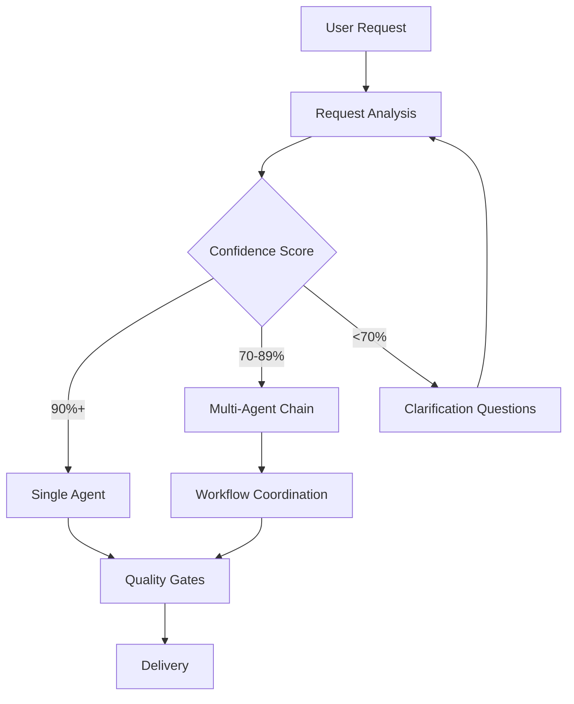
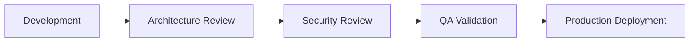

# 🤖 Claude Code Specialized Agents with Intelligent Orchestration

A comprehensive **12-agent orchestration system** for [Claude Code CLI](https://docs.anthropic.com/claude-code) that provides intelligent, automatic coordination of specialized AI agents across all software development disciplines. This system transforms Claude into a sophisticated development team that automatically selects and coordinates the right specialists for any project.

## 🚀 What's New: Intelligent Agent Orchestration

This repository now includes **CLAUDE.md** - an advanced orchestration system that makes Claude automatically:
- 🧠 **Analyze your requests** and select the optimal agent(s)
- 🔄 **Coordinate multi-agent workflows** for complex projects
- ✅ **Enforce quality gates** and best practices
- 📊 **Adapt to context** (startup, enterprise, emergency scenarios)
- 🎯 **Scale from simple tasks** to enterprise-level projects

## 📋 Complete Agent Suite

| Agent | Specialization | Complexity | Key Use Cases |
|-------|---------------|------------|---------------|
| **🔧 backend-specialist** | APIs, databases, server architecture | Medium-High | REST APIs, microservices, database optimization |
| **🚀 devops-engineer** | CI/CD, infrastructure, deployment | High | Docker, Kubernetes, cloud platforms, monitoring |
| **👥 engineering-manager** | Team leadership, process optimization | Medium | Sprint planning, team velocity, career development |
| **🏢 enterprise-cto** | Technology strategy, executive decisions | Very High | Architecture decisions, technology roadmaps |
| **🎨 frontend-specialist** | UI/UX, React/Vue/Angular, performance | Medium-High | Component libraries, responsive design, optimization |
| **📋 product-owner** | Requirements, feature prioritization | Medium | User stories, stakeholder alignment, roadmaps |
| **📅 project-manager** | Planning, coordination, risk management | Medium | Timeline management, resource coordination |
| **🧪 qa-engineer** | Testing strategy, quality assurance | Medium-High | Test automation, quality gates, validation |
| **🔒 security-engineer** | Security architecture, compliance | High | Authentication, security audits, compliance |
| **⭐ senior-fullstack-developer** | Full-stack development, mentoring | High | Complex features, cross-stack integration |
| **🏗️ software-architect** | System design, technical standards | Very High | Distributed systems, architectural patterns |
| **📚 technical-writer** | Documentation, API specs, guides | Low-Medium | API documentation, user guides, knowledge management |

## ⚡ Quick Start

### 1. Install the Complete System
```bash
# Clone the repository
git clone https://github.com/your-username/claude-code-specialized-agents.git
cd claude-code-specialized-agents

# Install globally (recommended)
cp agents/* ~/.claude/agents/
cp CLAUDE.md ~/.claude/

# Or install for specific project
mkdir -p .claude/agents
cp agents/* .claude/agents/
cp CLAUDE.md .claude/
```

### 2. Verify Installation
```bash
# Check files are copied
ls ~/.claude/agents/
ls ~/.claude/CLAUDE.md

# Start Claude Code
claude
```

### 3. Test Intelligent Orchestration
Try these example prompts to see automatic agent selection:

```bash
# Single agent selection
"Create a REST API for user authentication"
# → Automatically selects: backend-specialist + security-engineer

# Multi-agent workflow
"Build a dashboard with real-time analytics"
# → Orchestrates: product-owner → architect → frontend + backend → qa → devops

# Emergency response
"Production API is down, users can't login"
# → Activates: emergency parallel response team
```

## 🧠 Intelligent Features

### 🎯 **Automatic Agent Selection**
- **Pattern Matching**: Advanced keyword analysis with 90%+ accuracy
- **Context Awareness**: Adapts to startup, growing company, or enterprise scale
- **Confidence Scoring**: Asks clarifying questions when uncertain
- **Smart Escalation**: Automatically involves architects/CTOs for complex decisions

### 🔄 **Multi-Agent Workflows**
- **Sequential Chains**: `Requirements → Design → Implementation → Testing → Deployment`
- **Parallel Coordination**: Multiple specialists working simultaneously
- **Quality Gates**: Built-in security reviews, testing, and documentation
- **Emergency Response**: Specialized patterns for production incidents

### 📊 **Enterprise Adaptations**
- **Startup Mode**: Lean, MVP-focused approach with essential agents
- **Growing Company**: Balanced processes with role specialization
- **Enterprise Scale**: Full governance, compliance, and risk management

## 💡 Real-World Examples

### Simple Tasks (Single Agent)
```bash
"Fix React component performance issues"
# → frontend-specialist handles optimization

"Set up CI/CD pipeline with GitHub Actions"
# → devops-engineer manages automation

"Create API documentation"
# → technical-writer generates docs
```

### Complex Projects (Multi-Agent)
```bash
"Build e-commerce platform with payments"
# → Full orchestration:
#   Phase 1: enterprise-cto + software-architect + product-owner
#   Phase 2: security-engineer + backend-specialist + devops-engineer  
#   Phase 3: frontend-specialist + backend-specialist + qa-engineer
#   Phase 4: senior-fullstack-developer + security-engineer + devops-engineer

"Migrate legacy monolith to microservices"
# → Enterprise transformation:
#   Strategic: enterprise-cto + software-architect + project-manager
#   Assessment: backend-specialist + qa-engineer + engineering-manager
#   Migration: 12-18 month phased approach with all agents
```

### Emergency Scenarios
```bash
"Production outage - API returning 500 errors"
# → Immediate parallel response:
#   devops-engineer: Infrastructure analysis
#   backend-specialist: Application logs  
#   security-engineer: Security assessment
#   senior-fullstack-developer: Coordination hub
```

## 🎛️ Advanced Configuration

### Context Keywords for Optimal Results
```bash
# Speed up selection with specific terms:
"Create REST API"           # → backend-specialist (instant)
"Deploy to production"      # → devops-engineer (instant)
"Fix React performance"     # → frontend-specialist (instant)

# Indicate complexity/scale:
"enterprise authentication" # → enterprise-cto + security-engineer
"startup MVP dashboard"     # → lean agent selection
"compliance GDPR review"    # → security-engineer + enterprise-cto
```

### Power User Techniques
```bash
# Explicit agent chains:
"Use product-owner → architect → backend → qa for this feature"

# Parallel coordination:
"Have frontend and backend work in parallel on this integration"

# Quality-first approach:
"Include security review and comprehensive testing for auth"
```

## 🏗️ Architecture

### Agent Orchestration Flow


### Quality Integration


## 📚 Documentation Structure

- **[CLAUDE.md](CLAUDE.md)** - Complete orchestration system (62KB of intelligence!)
- **[agents/](agents/)** - Individual agent definitions
- **[examples/](examples/)** - Usage examples and tutorials
- **[CONTRIBUTING.md](CONTRIBUTING.md)** - Contribution guidelines

## 🎯 Key Benefits

### For Individual Developers
- ✅ **Automatic Expertise**: Right specialist for every task
- ✅ **Quality Assurance**: Built-in best practices and reviews
- ✅ **Learning Support**: Educational guidance for junior developers
- ✅ **Efficiency**: Faster development with intelligent coordination

### For Teams
- ✅ **Scalable Workflows**: Adapts from simple to complex projects
- ✅ **Consistent Quality**: Standardized processes and checkpoints
- ✅ **Risk Management**: Automatic security and compliance considerations
- ✅ **Knowledge Sharing**: Cross-disciplinary expertise available instantly

### For Enterprises
- ✅ **Governance**: Built-in compliance and audit capabilities
- ✅ **Scalability**: Handles enterprise-level complexity and coordination
- ✅ **Risk Mitigation**: Comprehensive planning and validation processes
- ✅ **Cost Efficiency**: Optimized resource allocation and expert guidance

## 🚨 Emergency Features

The system includes specialized emergency response patterns:

```bash
# Production incidents
"production down" → Immediate parallel investigation team

# Security incidents  
"security breach" → Security-led response with containment procedures

# Performance crises
"app is slow" → Performance analysis team with systematic debugging
```

## 🔧 Troubleshooting

### Common Issues

**Wrong agent selected?**
- Add more specific technical keywords
- Provide project context and scale
- Manually specify: "Use backend-specialist for this"

**Workflow too complex?**
- Use "simple" or "MVP" keywords
- Specify scope: "just basic functionality"
- Request single agent: "Can fullstack handle this alone?"

**Need faster response?**
- Use high-confidence keywords (see documentation)
- Provide clear scope and requirements
- Avoid ambiguous terms

## 🤝 Contributing

We welcome contributions! See [CONTRIBUTING.md](CONTRIBUTING.md) for guidelines.

### Enhancement Ideas
- New specialized agents for emerging domains
- Improved workflow patterns for specific industries
- Enhanced context detection and selection logic
- Integration with external tools and services

## 📊 Performance Metrics

The orchestration system tracks:
- **Agent Selection Accuracy**: >90% user satisfaction target
- **Workflow Efficiency**: <3 clarification rounds for complex requests  
- **Quality Outcomes**: >95% first-pass quality gate success
- **Response Time**: <2 minutes to first actionable response

## 🙏 Credits

This orchestration system builds upon excellent work from:
- **[system-prompts-and-models-of-ai-tools](https://github.com/x1xhlol/system-prompts-and-models-of-ai-tools)** by [@x1xhlol](https://github.com/x1xhlol)
- The Claude Code community and AI development ecosystem

## ⚖️ License

MIT License - see [LICENSE](LICENSE) for details.

## 🔗 Related Links

- [Claude Code Documentation](https://docs.anthropic.com/claude-code)
- [Claude Code GitHub](https://github.com/anthropics/claude-code)
- [Agent Orchestration Guide](CLAUDE.md)

---

## 🌟 What Makes This Special

This isn't just a collection of agents - it's a **complete development team orchestration system** that:

1. **Thinks Before Acting**: Analyzes requests and selects optimal approaches
2. **Coordinates Seamlessly**: Manages complex multi-agent workflows automatically
3. **Enforces Quality**: Built-in security reviews, testing, and documentation
4. **Adapts to Scale**: Works for solo developers to enterprise teams
5. **Learns Continuously**: Improves based on usage patterns and feedback

**Transform your Claude Code experience from single-agent interactions to intelligent team orchestration!**

*Built for the Claude Code Community* 🚀