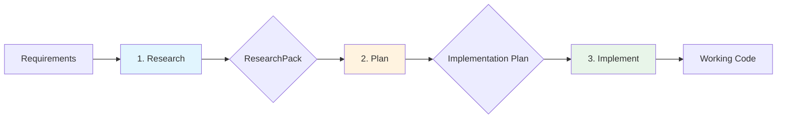

# 📘 Claude Code Workflow Guide

> A comprehensive guide to mastering the Research → Plan → Implement workflow for professional software development.

## Table of Contents
- [Understanding the Workflow](#understanding-the-workflow)
- [Phase 1: Research (docs-researcher)](#phase-1-research-docs-researcher)
- [Phase 2: Planning (implementation-planner)](#phase-2-planning-implementation-planner)
- [Phase 3: Implementation (code-implementer)](#phase-3-implementation-code-implementer)
- [Workflow Patterns](#workflow-patterns)
- [Best Practices](#best-practices)
- [Common Anti-Patterns](#common-anti-patterns)
- [Troubleshooting](#troubleshooting)

## Understanding the Workflow

### The Core Philosophy

The Research → Plan → Implement workflow is built on four fundamental principles:

1. **Never Code from Memory**: Always verify with current documentation
2. **Plan Before Acting**: Think through changes before making them
3. **Minimize Risk**: Make surgical, reversible changes
4. **Verify Everything**: Test and validate at each step

### Why This Workflow Matters

Traditional development often follows this problematic pattern:
```
Idea → Code → Debug → Refactor → Debug → Ship (hopefully)
```

Our workflow transforms this into:
```
Idea → Research → Plan → Implement → Verify → Ship (confidently)
```

### The Three Phases



## Phase 1: Research (docs-researcher)

### Purpose
The research phase ensures every implementation decision is based on current, authoritative information rather than potentially outdated knowledge.

### When to Engage docs-researcher

#### Automatic Triggers
The agent activates when you use keywords like:
- "documentation", "docs", "API reference"
- "how to use", "correct usage", "best practices"
- "library", "framework", "package", "SDK"
- "version", "upgrade", "migrate", "update"

#### Manual Activation
```bash
> Use docs-researcher to research [topic]
```

### What docs-researcher Does

1. **Version Detection**
   - Examines your project files (package.json, requirements.txt, etc.)
   - Identifies exact library versions in use
   - Flags version mismatches

2. **Documentation Gathering**
   - Fetches from official sources only
   - Prioritizes current stable versions
   - Includes migration guides when relevant

3. **ResearchPack Creation**
   - Structures findings into actionable format
   - Links all sources for verification
   - Highlights breaking changes and gotchas

### ResearchPack Structure

A complete ResearchPack contains:

```markdown
### Task & Context
- Goal: Clear statement of objective
- Target stack: Technologies involved
- Library & Version: Exact versions

### What the docs say (ground truth)
- Key APIs: Signatures and usage
- Required setup: Installation and config
- Common pitfalls: Known issues
- Minimal example: Working code snippet

### Implementation checklist
- [ ] Prerequisites
- [ ] Step-by-step tasks
- [ ] Edge cases to handle

### Sources
1. [Official documentation links]
2. [API references]
3. [Migration guides]
```

### Research Best Practices

#### ✅ DO:
- Specify exact versions when known
- Request focused research on specific features
- Verify research currency before proceeding

#### ❌ DON'T:
- Skip research for "simple" features
- Assume documentation hasn't changed
- Proceed without complete ResearchPack

### Example Research Scenarios

#### Adding a New Library
```bash
> Research Stripe payment integration for Node.js

# docs-researcher will:
# 1. Detect Node.js version from package.json
# 2. Fetch latest Stripe Node SDK docs
# 3. Include PCI compliance considerations
# 4. Provide webhook setup guide
```

#### Updating Dependencies
```bash
> Research migrating from Webpack 4 to Webpack 5

# docs-researcher will:
# 1. Fetch official migration guide
# 2. Identify breaking changes
# 3. List plugin compatibility
# 4. Include configuration changes
```

## Phase 2: Planning (implementation-planner)

### Purpose
The planning phase transforms research into executable blueprints, ensuring changes are minimal, safe, and reversible.

### Prerequisites
- ✅ Valid ResearchPack from docs-researcher
- ✅ Clear understanding of requirements
- ✅ Access to current codebase

### When to Engage implementation-planner

#### Automatic Triggers
- "plan", "design", "architecture", "blueprint"
- "what files", "where to implement"
- "implementation strategy", "approach"
- "based on research", "using the research"

#### Manual Activation
```bash
> Use implementation-planner to create a plan for [feature]
```

### What implementation-planner Does

1. **Codebase Analysis**
   - Explores repository structure
   - Identifies integration points
   - Maps research to existing code

2. **Change Set Design**
   - Determines minimal modifications
   - Preserves existing contracts
   - Plans incremental changes

3. **Risk Assessment**
   - Identifies potential issues
   - Plans mitigation strategies
   - Designs rollback procedures

### Implementation Plan Structure

A complete plan contains:

```markdown
### Summary
Brief overview of changes and rationale

### File-by-file changes
- `path/to/file1.js`: Add authentication middleware
- `path/to/file2.js`: Update API endpoints
- `path/to/new-file.js`: Create auth service

### Step-by-step procedure
1. Install dependencies
2. Update configuration
3. Implement auth service
4. Add middleware
5. Update tests

### Test plan (acceptance criteria)
- Unit tests for auth service
- Integration tests for endpoints
- Manual testing checklist

### Risks & mitigations
- Risk: Breaking existing sessions
  → Mitigation: Gradual rollout with feature flag

### Rollback procedure
1. Revert commits
2. Remove feature flag
3. Clear cache
```

### Planning Best Practices

#### ✅ DO:
- Keep changes minimal and focused
- Include comprehensive test criteria
- Plan for gradual rollout
- Document all assumptions

#### ❌ DON'T:
- Plan without complete research
- Ignore existing patterns
- Skip rollback planning
- Over-engineer solutions

### Example Planning Scenarios

#### Feature Addition
```bash
> Plan Redis caching based on the research

# implementation-planner will:
# 1. Analyze current data flow
# 2. Identify cache points
# 3. Plan cache key strategy
# 4. Design fallback behavior
```

#### Architecture Change
```bash
> Plan microservices extraction for user service

# implementation-planner will:
# 1. Map service boundaries
# 2. Plan data migration
# 3. Design API contracts
# 4. Phase the transition
```

## Phase 3: Implementation (code-implementer)

### Purpose
The implementation phase executes the plan with surgical precision, making only the changes specified.

### Prerequisites
- ✅ Valid ResearchPack
- ✅ Complete Implementation Plan
- ✅ Plan approval/review

### When to Engage code-implementer

#### Automatic Triggers
- "implement the plan", "execute the plan"
- "make the changes", "apply changes"
- "code it", "build it" (with existing plan)

#### Manual Activation
```bash
> Use code-implementer to execute the implementation plan
```

### What code-implementer Does

1. **Plan Validation**
   - Verifies ResearchPack presence
   - Confirms plan completeness
   - Checks preconditions

2. **Precise Execution**
   - Makes only specified changes
   - Follows plan exactly
   - Preserves code style

3. **Verification**
   - Runs specified tests
   - Validates changes
   - Reports results

### Implementation Report Structure

```markdown
### Changes made
- Modified `src/api/routes.js` - Added auth middleware
- Created `src/services/auth.js` - Authentication service
- Updated `tests/api.test.js` - New test cases

### Diffs (high level)
- routes.js: Added authMiddleware to protected routes
- auth.js: Implemented JWT token validation
- api.test.js: Added 5 auth test cases

### Commands run
- `npm install jsonwebtoken`
- `npm test` - All tests passing
- `npm run lint` - No issues

### Follow-ups
- Consider rate limiting for auth endpoints
- Add refresh token support in next iteration

### Sources respected
- ResearchPack from [timestamp]
- JWT best practices implemented per docs
```

### Implementation Best Practices

#### ✅ DO:
- Follow the plan exactly
- Make atomic commits
- Run tests after each change
- Document any deviations

#### ❌ DON'T:
- Improvise beyond the plan
- Skip verification steps
- Make unplanned "improvements"
- Ignore test failures

## Workflow Patterns

### Pattern 1: Standard Feature Development
```
1. Research library/framework needed
2. Plan integration approach
3. Implement incrementally
```

### Pattern 2: Dependency Update
```
1. Research version changes and migration
2. Plan phased update strategy
3. Implement with verification at each step
```

### Pattern 3: Bug Fix Investigation
```
1. Research correct behavior from docs
2. Plan minimal fix
3. Implement with regression tests
```

### Pattern 4: Performance Optimization
```
1. Research optimization techniques
2. Plan measurements and changes
3. Implement with benchmarks
```

## Best Practices

### General Workflow

1. **Always Complete Each Phase**
   - Never skip research "to save time"
   - Always plan before implementing
   - Verify each step

2. **Use Incremental Approach**
   - Small, verified changes
   - Commit frequently
   - Test continuously

3. **Document Decisions**
   - Why specific approaches chosen
   - Trade-offs considered
   - Assumptions made

### Phase Transitions

#### Research → Planning
- Ensure ResearchPack is complete
- Verify version accuracy
- Confirm all questions answered

#### Planning → Implementation
- Review plan thoroughly
- Ensure rollback strategy exists
- Confirm test criteria clear

### Error Handling

1. **Research Failures**
   - Incomplete documentation → Specify what's needed
   - Version conflicts → Clarify requirements
   - Missing info → Use alternative sources

2. **Planning Issues**
   - Ambiguous requirements → Seek clarification
   - Complex changes → Break into phases
   - High risk → Add more safeguards

3. **Implementation Problems**
   - Plan doesn't match reality → Stop and replan
   - Tests failing → Fix before proceeding
   - Unexpected issues → Document and adapt

## Common Anti-Patterns

### ❌ "I Know This Library"
**Problem**: Skipping research because you've used it before
**Result**: Missing breaking changes or new best practices
**Solution**: Always research, even familiar libraries

### ❌ "Let's Just Try It"
**Problem**: Implementing without planning
**Result**: Large, risky changes that are hard to revert
**Solution**: Plan first, no matter how simple

### ❌ "While I'm Here..."
**Problem**: Making additional changes during implementation
**Result**: Scope creep and untested code
**Solution**: Stick to the plan, note improvements for later

### ❌ "Trust Me, It Works"
**Problem**: Skipping verification steps
**Result**: Bugs in production
**Solution**: Always run planned tests

## Troubleshooting

### Research Phase Issues

**Problem**: Can't find documentation
- Try: Specify exact library name and version
- Try: Check GitHub repo for docs
- Try: Look for community resources

**Problem**: Conflicting information
- Try: Prioritize official docs
- Try: Check documentation date
- Try: Verify version alignment

### Planning Phase Issues

**Problem**: Plan too complex
- Try: Break into multiple phases
- Try: Focus on MVP first
- Try: Identify critical path

**Problem**: Missing ResearchPack
- Try: Complete research first
- Try: Specify what research needed
- Try: Link existing research

### Implementation Phase Issues

**Problem**: Plan doesn't match code
- Try: Stop and reassess
- Try: Update plan first
- Try: Document discrepancies

**Problem**: Tests failing
- Try: Verify test assumptions
- Try: Check for side effects
- Try: Run tests in isolation

## Advanced Techniques

### Parallel Research
```bash
> Use Task tool with docs-researcher to research Redis, PostgreSQL, and MongoDB caching strategies
```

### Phased Planning
```bash
> Create a three-phase plan for migrating to microservices
```

### Incremental Implementation
```bash
> Implement phase 1 of the migration plan with feature flags
```

## Summary

The Research → Plan → Implement workflow transforms chaotic development into systematic, professional software engineering. By following this guide:

- 🎯 Your code will always use current best practices
- 🛡️ Your changes will be minimal and safe
- 🔄 Your implementations will be reversible
- ✅ Your work will be verified and tested

Remember: **Good software is not written, it's researched, planned, and then implemented.**

---

Next: [Quick Reference Guide](quick-reference.md) | [Real-World Examples](../examples/real-world-scenarios.md)